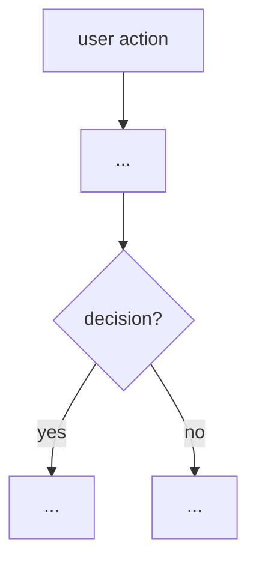

# Subsystem: <NAME>

> Built live, from operating the dev server — first-principles, not from the Atlas.
> Cross-checked against `docs/atlas/` only as an answer-key. Date: <YYYY-MM-DD>.

## 1. What it is (one paragraph)
<plain-language: what this subsystem does for the user, where it starts and ends>

## 2. Live flow chart

<built from what we actually saw fire, with file:line on each node>

## 3. Inputs → Qwen → Outputs (per model call)
| Step | What goes IN (prompt/data) | Model + params | What comes OUT | Persisted where |
|------|----------------------------|----------------|----------------|-----------------|
| | | | | |

## 4. What's captured / what influences what
<for stateful subsystems: exactly what data is stored, and how it propagates downstream>

## 5. Live vs Atlas (delta)
<where observed behavior differs from what the code/atlas implied — bugs live here>

## 6. Decisions made
- D1: <decision> — <rationale>

## 7. Work spotted (→ becomes commits / rework branch)
| # | Sev | Item | file:line | Status |
|---|-----|------|-----------|--------|
| | | | | |

## 8. Open questions
- <unresolved>
