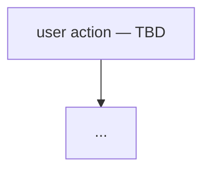

# Subsystem: Audience (the moat)

> Built live, from operating the dev server — first-principles, not from the Atlas.
> Cross-checked against `docs/atlas/02-audience-subsystem.md` only as an answer-key. Date: 2026-06-22.
>
> **Status: LIVE-TRACE IN PROGRESS.** Sections below carry `🔵 OBSERVED` once we
> see the call fire, `⚪ UNTRACED` until then. Atlas claims are listed as
> *hypotheses* in §H — confirmed/refuted only against live evidence.

## 1. What it is (one paragraph)
⚪ UNTRACED — fill after we run create + calibrate end-to-end.
<plain-language: what an audience does for the user, where it starts (create/calibrate) and ends (frozen DB row that biases every skill's SIM reaction + grounding line)>

## 2. Live flow chart

⚪ UNTRACED — built from what we actually saw fire, with file:line on each node.

## 3. Inputs → Qwen → Outputs (per model call)
| Step | What goes IN (prompt/data) | Model + params | What comes OUT | Persisted where | Status |
|------|----------------------------|----------------|----------------|-----------------|--------|
| create | | (no LLM?) | | audiences row | ⚪ |
| calibrate scrape | | (Apify, no LLM?) | | audiences row | ⚪ |
| skill-time SIM | repaint fold | Flash temp0+seed | personas[] verdicts | thread/blocks | ⚪ |

## 4. What's captured / what influences what
⚪ UNTRACED — exactly what lands on the row, and how it propagates to skills.

## 5. Live vs Atlas (delta)
_Deltas logged here as we find them. Empty = nothing traced yet._

| # | Atlas claims | Live shows | file:line | Verdict |
|---|--------------|------------|-----------|---------|
| | | | | |

## 6. Decisions made
- _(none yet)_

## 7. Work spotted (→ becomes commits / rework branch)
| # | Sev | Item | file:line | Status |
|---|-----|------|-----------|--------|
| F1 | HIGH | `deriveAudienceProfile` ignores scraped videos → `temperature_mix`/`top_dispositions` identical for every audience; only `follower_tier` is real | `calibration.ts:66-106` | design fix in §P (Flash-derived) |
| F3 | HIGH | `resolveAudienceWeights` dead-wired (`void`) in ideas/hooks/script/remix/chat + two-audience-read — weights influence nothing in text product | `*-runner.ts` | §P keeps weights real for Max/flywheel; voice is live lever |
| S1 | MED | video scrape's only consumed output is `videos.length` (thin gate) — 120s actor for 1 int; `profile.videoCount` may suffice | `calibration.ts:194,211` | superseded by §P (1 actor, engagement consumed) |
| C1 | ~~HIGH~~ **FIXED 2026-06-24** | composer **intent** toggle now sent to all 5 skill run bodies (hooks/ideas/script/remix/react) → `intent-lens.ts` lens reframes the SIM verdict (sell→buying lens) for calibrated audiences; General = no-op | `composer.tsx`, `use-*-stream.ts`, run routes, `flash-prompts.ts` | §P.10 (DONE) |
| C2 | ~~LOW~~ **RESOLVED 2026-06-24** | DECIDED "keep 2, derive down": composer stays 2-value (`grow\|sell`) per-run lens; `goalIntentToLens` maps audience 4→2 for the default (authority/nurture→grow, baked at calibration); run-body `intent` is the 2-value lens | `intent-lens.ts` | §P.10 (DONE) |
| C3 | MED | no handle validation — wrong handle silently calibrates off a dead account (live: @kallawaymarketing=553f/8vids "old account") | calibrate flow | reveal screen (P.5) confirm-before-persist |

## 8. Open questions
- _(carry forward unresolved items from the trace)_

---

## P. PROPOSED: real AudienceSignature (design complete · live-validated · BUILD-READY)

> **STATUS 2026-06-24:** critical path **P.11 steps 1→5 BUILT** (schema+types → scrape-collapse
> → enrich-signature → calibration → reveal). All unit-tested mock-first (zero live LLM in CI);
> ENGINE_VERSION untouched; signature gates behind non-general only; General-regression gate green.
> Migration `20260624000000_audience_signature.sql` (ADDITIVE: `signature`+`creator_persona` cols,
> legacy `profile`/`personas`/weights kept). New module `src/lib/audience/enrich-signature.ts`.
> **LIVE-UAT'd 2026-06-24** (@doctormike, real Apify+DashScope): real discriminating signature,
> invariants pass. Two bugs found+fixed: (1) omni 400 — Apify KV mp4 needs `?token=` appended;
> (2) per-video rehost (`resolveVideoUrl`) was flaky (3/5 fail) → **collapsed to ONE bundle scrape
> with `shouldDownloadVideos:true`** (probe: mediaUrls 12/12), `resultsPerPage:12`, watch reads
> `mediaUrl` directly → 6 Apify runs → 1, watches 0/5→5/5 reliable. Cost ~$0.05 total (12 videos),
> ~1.5min wall-clock (download-12 dominates). DECIDED 2026-06-24: keep single 12-download run —
> one-time async bake behind progress UI, cost great, preserves full 12-video engagement signal +
> top-5 watch. Do NOT scrape only 5 (collapses engagement sample + trips THIN_MIN_VIDEOS=10).
> FUTURE latency lever (only if it becomes a UX complaint): decouple — metadata-12 (no download)
> ∥ download-latest-5 → ~halves wall-clock, downloads only the watched 5, keeps the 12-video signal;
> cost = +1 Apify run + watched set becomes latest-5 not top-5. NOT built (premature).
> **Still OPEN:** P-6 (subset-transcribe — verify on first LIVE run; default free-subs-only holds).
> **DONE 2026-06-24:** step 7 (gen/SIM wiring) + step 8 (composer intent, GAP-C1+C2 — see §P.10)
> + step 9 (flywheel/drift re-bake — `cron/audience-drift` now persists the freshly-derived
> signature/creator_persona/profile/personas/calibration on every clean re-scrape; `persona_weights`
> stays the flywheel's slot. +5 route tests).
> **Still DEFERRED:** live UAT of the enrich/synth LLM calls against real DashScope/Apify (unit-mocked).
>
> **STATUS 2026-06-22 (design):** design complete, every assumption live-validated (P.12 scrape,
> P.13 omni-watch, P.14 prompts+schema). Cost ~$0.05–0.15/audience one-time.
>
> Captured 2026-06-22 from the brainstorm. Goal: make the audience **real** —
> derived from the account, not a static goal-intent lookup. The audience is the
> foundation that flows into personas → reactions → skills → every output, and the
> composer must re-shape all of it when the user switches audience/intent.

### P.0 The problem this fixes
Today: 2 Apify actor runs → rich payload → **1 scalar survives** (`follower_tier`).
`temperature_mix` + `top_dispositions` are counted off a fixed 10-archetype lens →
**identical for every audience** (F1). Personas are static `base + intent-suffix` prose.
Weights are `void` in 5 runners (F3). Net: switching audiences barely changes output;
the moat is a costume. Create flow shows the user nothing → no proof it's real.

### P.1 Locked architecture — bake once, read everywhere
```
CALIBRATE (once per audience; re-run only on weekly drift cron):
  [1 SCRAPE]  clockworks/tiktok-profile-scraper(handle, resultsPerPage:15-20, latest, free subs)
                → ONE actor run: account stats + videos w/ engagement + native subtitleLinks
  [WATCH ~3-5] qwen3.5-omni-flash watches the TOP videos by engagement (video+audio)
                → content/format/visual-style/energy notes (universal: talkers AND silent creators)
  [1 FLASH]   text-flash synthesis (temp 0 + seed) — stats+engagement+subs+watch-notes
                → AudienceSignature JSON
  → store AudienceSignature on audiences row (frozen)
  → REVEAL screen: show the scraped profile + posts + derived audience (proof it's real)

EVERY SKILL RUN (zero scrape, zero LLM-for-audience — reads frozen signature):
  STEER  → grounding line + prompt context   ← engagement_profile + interest_tags
  REACT  → persona repaint + voice            ← persona_voice (the SIM fold)
  REFINE → flywheel nudge + drift refresh     ← weights + re-bake on drift

COMPOSER:
  switch audience → swap active AudienceSignature  (free, pre-baked)
  change intent   → re-bias weights + shift emphasis (free, pre-baked)
  [later] live attribute edit → recompute ambient context for one run (no scrape)
```
**Determinism contract:** the Flash call runs ONLY at calibration (rare, one-time per
audience), output frozen on the row. The per-skill hot path never calls an LLM for the
audience → stays byte-deterministic (SIM temp 0 + seed), cache-safe, General-regression
gate stays green. Non-determinism is contained to the one-time bake; drift cron re-bakes
intentionally. (See P.7.)

### P.2 Clockworks API — what we request / receive / use
**Actor:** `clockworks/tiktok-profile-scraper` (single run = profile + videos).
**Input we send:**
```jsonc
{ "profiles": ["<handle>"],
  "resultsPerPage": 15,              // 10-20 videos (DECISION P-1) — fewer but transcribed
  "shouldDownloadVideos": false,     // no media — metadata only
  "shouldDownloadCovers": false,
  // P-4: free native subs first; AI-transcribe ONLY because it's $48/1k per started minute:
  "downloadSubtitlesOptions": "DOWNLOAD_SUBTITLES"   // free; AI-transcribe capped separately ≤5
}
```
**Transcript economics (CONFIRMED via pricing screenshot):** AI transcript is an add-on at
**$48 / 1,000 per STARTED minute per video** (cheaper tier $27/1k). "Per started minute" ⇒
30s still bills a full minute, so a sub-minute cap saves nothing — the only lever is **video
COUNT**. Plan: **free native subtitles** for all scraped videos; **AI-transcribe at most 5**
(the top/representative ones) for creator-voice signal. Transcripts feed the **Creator
Persona voice**, not the audience dispositions (those come from engagement ratios).
> ⚠ Open: the actor applies `downloadSubtitlesOptions` to ALL returned videos — selectively
> transcribing only 5 may need a 2nd tiny scrape (5 videos, TRANSCRIBE_ALL) OR accept free
> subs only. Verify on first live run; default to FREE subs until cost is confirmed.
**Receive — account level** (`authorMeta`): `name, nickName, signature(bio), avatar,
verified, fans(followers), following, heart(total likes), video(count), region`.
**Receive — per video (×N):** `playCount, diggCount, commentCount, shareCount,
collectCount, text(caption), hashtags[], musicMeta{name,original}, videoMeta{duration},
createTime, isPinned, isAd, webVideoUrl, coverUrl` **+ `subtitles`/transcript text (P-4)**.

**How we use each (raw → meaning):**
| Raw signal | Becomes |
|---|---|
| `fans/heart/video` counts | `follower_tier`, `maturity` (new vs established) |
| per-video engagement RATIOS (save/share/comment/like ÷ plays) | `engagement_profile` → REAL `temperature_mix` + `dispositions` (kills F1) |
| top vs flop videos | `what_resonates` / `what_falls_flat` — what THIS audience rewards |
| captions + hashtags + bio | `interest_tags`, `niche`, `content_themes` |
| all of the above | `persona_voice` (drives REACT) + `audience_summary` (reveal copy) |

### P.3 Two artifacts from one scrape + one Flash call (CORRECTED)
A "custom audience" = **Creator Persona** + **10 Audience Personas**, from DIFFERENT signals:
- **Creator Persona** ← transcripts + captions + bio → who the creator is / what the account
  is about / **their voice**. Drives generation so outputs SOUND LIKE THEM. Net-new to engine.
- **Audience (10 personas)** ← engagement RATIOS → disposition + share + reaction-frame.
  Pure REACTORS. **No voice, no bio** — they judge content, they don't speak as the creator.

Flash input: account stats + N video rows (engagement + caption + hashtags) + ≤5 transcripts
+ goalIntent. Output (`AudienceSignature`, stored JSONB):
```jsonc
{
  "creator_persona": {                    // ABOUT THE CREATOR — Sandcastles' PROVEN 3 fields,
                                          // but AUTO-DERIVED from scrape+transcripts (their wedge:
                                          // they make the user TYPE all 3 by hand). All editable.
    "content_description": "ADHD productivity & fast actionable systems",   // niche → STEER (discovery/idea analysis)
    "context": "Audience: entrepreneurs growing on social. Voice: blunt, contrarian, data-backed, no hype. Formats: breakdown/explainer, hot-take-with-evidence, framework reveals. Expertise: hook mechanics, AI tools, personal branding. Avoid: vague generalities, hype words, passive voice.",  // → GENERATION (all scripts)
    "writing_style_sample": "<verbatim transcript of their top-performing video>"  // → GENERATION voice; the TRANSCRIPT is the sample
  },
  "audience": {                           // THE 10 REACTORS (no voice)
    "follower_tier": "mid", "maturity": "established",
    "temperature_mix": { "cold": .2, "warm": .5, "hot": .3 },   // DATA-DERIVED (fixes F1)
    "interest_tags": ["adhd", "productivity", "tools"],
    "what_resonates": "step-by-step saves; they bookmark utility",
    "what_falls_flat": "talking-head storytime underperforms",
    "persona_weights": { "fyp": .55, "niche": .30, "loyalist": .10, "cross_niche": .05 },  // DERIVED (P-5)
    "personas": [ { "archetype": "saver", "share": .15, "disposition": "collector",
                    "reaction_frame": "bookmarks reusable utility; skips fluff",
                    "evidence": "saves 2.1× category" }, … ]    // 10 reactors; NO voice/bio
  },
  "summary": "warm, save-heavy productivity crowd that bookmarks quick systems…"  // reveal copy
}
```
Per-skill: `creator_persona.context` + `writing_style_sample` fold into the GENERATION prompt
(outputs sound like the creator); `content_description` grounds discovery/idea-analysis (STEER);
`audience.personas[].reaction_frame` folds into the SIM (REACT); `summary` + `interest_tags` +
`what_resonates` ground STEER.

**P-5 RESOLVED — Flash builds the real persona/audience data from the Apify payload.**
The whole signature (dispositions, shares, voice, themes, AND `persona_weights`) is
DERIVED by Flash from the actual scraped engagement + transcripts — not a static
goal-intent lookup. `goal_intent` becomes a **lens/bias on top** of the real data, not
the sole source. So a save-heavy account leans collector/loyalist *because the data says
so*, then intent nudges it. (Reality first, intent second.)
> Wiring note: the derived `persona_weights` are real now, but the text runners still
> `void` weights (F3) — so today the *voice/dispositions/summary* drive output; the
> *numeric* weights become real-but-still-future-wired (Max path + flywheel). Voice is
> the live lever; weights stop being fake.

### P.4 Personal vs Target (P-2 profile-first; P-8 creator persona is PER-AUDIENCE)
**Every audience row carries BOTH a `creator_persona` and 10 `audience.personas`** — bound
together. Creator persona is NOT profile-level: one creator may run multiple accounts with
different voices/objectives, so it travels with the audience. **Target audiences create a
creator persona too.**
| | Personal | Target |
|---|---|---|
| 1-scrape source | own account `tiktok-profile-scraper` | **named/handle profile FIRST** (own OR a reference to emulate); if none/thin → `tiktok-scraper` **search mode** on the niche (exemplar creators) |
| `creator_persona` from | the scraped account | the reference profile if given; else synthesized from niche exemplars + the creator's description |
| `audience.personas` from | self engagement ratios | the niche/reference engagement ratios |
| Reveal | "your account + your audience" | "this creator/niche → your creator voice + the audience you're targeting" |
| New user / thin personal | fall back to target-style niche scrape (NOT dead-end to General) | — |

### P.5 Reveal screen — the "it's real" showcase (Sandcastles bar)
Sandcastles' whole pitch: *"Every AI persona is based on a real person."* We go further —
we show the **actual scraped account**:
```
✓ We read @handle
[avatar] Display Name ✓ · 142K followers · 3.2M likes · 87 videos · bio line
┌ POSTS GRID (the real scraped videos) ─────────────────────────┐
│ [thumb] 1.2M plays · 4% save   [thumb] 80K · 12% share   …     │
└───────────────────────────────────────────────────────────────┘
"Here's your audience:"  ← audience_summary
 • warm · save-heavy · bookmarks tutorials
 • interests: meal prep · budgeting · adhd
 • what resonates: step-by-step utility
[ 10 persona chips → opens persona page ]      [ Use this audience → ]
```
Doubles as the confirm-before-persist gate. Everything shown is already in the 1 scrape.

### P.6 Two different 3-section cards (DON'T share a schema)
**Creator persona = Sandcastles' PROVEN 3** (verified from their real Persona page —
@kallawaymarketing), auto-derived + editable (their wedge: users type these by hand):
1. **Content description** — niche descriptor → feeds discovery + idea analysis (STEER).
2. **Context** — audience + voice + formats + expertise + **Avoid** list → feeds generation.
3. **Writing style** — a verbatim **script sample to emulate** → feeds generation voice. *Our
   transcript IS this sample* — the single strongest reason to pay for ≤5 transcripts.
One creator persona per audience row (P-8).

**Audience personas = OUR behavioral 3** (Sandcastles has NO audience personas — this is the
net-new moat; do NOT graft creator fields onto reactors — a reactor has no "writing style"):
1. **Who they are** — archetype, temperature, disposition, share %.
2. **What they reward** — engagement evidence (saves/shares behavior) — the data proof.
3. **How they react** — `reaction_frame`: what makes them stop/save vs scroll past → SIM lens.
FIXED engine slugs; content per-audience (A's "saver" ≠ B's "saver"). `label` editable; engine
never reads it (regression surface stays clean).

### P.7 Determinism — explained
- **Definition:** same input → same output, every time.
- **Why the engine needs it:** SIM scoring runs `temp 0 + seed` so a given content scores
  identically on every run → reproducible, cache-safe, and the General-audience regression
  gate is "free by construction" (`resolveAudienceWeights([])` always = DEFAULT).
- **Risk an LLM adds:** LLMs sample → re-deriving the audience per skill run would drift
  every generation (can't reproduce, can't cache, breaks the gate).
- **Mitigation (why ours is safe):** the Flash call runs **once at calibration**, temp 0 +
  seed, and its output is **frozen on the row**. The hot path reads frozen JSON — never
  calls the LLM. Any residual LLM non-determinism is absorbed by the one-time bake; the
  weekly drift cron is the ONLY place it re-bakes, and that's intentional.

### P.8 Cost (Apify base pay-per-result $0.005/item)
| Component | per audience (one-time) |
|---|---|
| 15 videos base | **~$0.075** |
| native subtitles (`DOWNLOAD_SUBTITLES`) | **free** — live probe: 6/8 coverage incl. top video |
| transcript text fetch (VTT via `tiktokLink`) | **free** (no auth) |
| AI transcription | **NEVER** (P-4 — $48/1k never paid) |
| omni-flash watch ×3–5 (P.13) | **~$0.005–0.02** (live: $0.0008/12s video; omni-plus $0 preview) |
| text-flash synthesis | ~cents (1 call) |
| **est. total (typical)** | **~$0.05–0.15 per audience, one-time** |
Drift cron = same, weekly. Both the $0.24 transcript fear AND the omni-cost fear were wrong —
native subs free (P.12), omni-flash watch ≈ free (P.13). Calibration is genuinely cheap.

### P.9 Decisions
- ✅ P-keep: 1 scrape + 1 Flash, bake-once, frozen signature.
- ✅ P-1: **10-20 videos (target 15)** — fewer but transcribed beats many-shallow.
- ✅ P-2: target = profile-first, then niche search.
- ✅ P-3: Flash at calibration only (temp 0 + seed); hot path deterministic.
- ✅ P-4 / P-6 RESOLVED (live probe P.12): `downloadSubtitlesOptions:"DOWNLOAD_SUBTITLES"` —
  **free native subtitles ONLY. AI transcription NEVER fires, not even as fallback** (never pay
  $48/1k). No native sub on a video → use its caption; sub-sparse account → `writing_style_sample`
  falls back to top captions. Transcript text fetches free via `tiktokLink` (no auth).
- ✅ P-10b SCRAPE CONFIG: `resultsPerPage:15-20` (cap; fewer for low-posters), `profileSorting:
  "latest"` (current audience + voice, includes flops for `what_falls_flat`; NOT "popular" =
  stale/biased), `excludePinnedPosts:true` (pinned skews ratios). Writing sample = top-engagement
  video AMONG the latest set.
- ✅ P-11 VIDEO-WATCH (P.13): add a `qwen3.5-omni-flash` watch layer over the **top ~3–5 videos
  by engagement** (video+audio, sense-complete) — REQUIRED because text-only is blind on silent
  visual creators (probe 2: @khaby 1/20 subs). NOT 3.6-flash (deaf). Two-tier: scrape wide/cheap,
  watch narrow/deep. Calibration-only → hot path stays deterministic.
- ✅ P-5: **Flash derives the real persona/audience data (incl. weights) from the Apify
  payload**; goal_intent is a lens on top, not the source. Reality first, intent second.
- ✅ P-7 (CORRECTED): two artifacts — **Creator Persona** (3-section card, voice, drives
  generation) + **10 Audience Personas** (reactors, no voice, drive SIM). Both from 1 scrape.
- ✅ P-8: **`creator_persona` is a PER-AUDIENCE field on the audience row** (not profile-
  level) — supports multi-account creators with distinct voices. Target audiences also
  produce a creator persona.
- ✅ P-9: creator persona adopts **Sandcastles' proven 3 fields** (content description /
  context / writing-style sample), AUTO-derived + editable (their wedge: manual typing).
  Audience personas keep OUR behavioral 3 (who / what they reward / how they react) — NOT
  Sandcastles-shaped. `writing_style_sample` = a real transcript → justifies the ≤5 transcripts.
- ⏳ P-6: confirm whether the actor can transcribe a SUBSET (≤5) in one run, or needs a 2nd
  tiny scrape — verify live.

### P.10 Composer reactivity — wiring (grounded in current code)
Composer LEFT cluster = `composer-controls.tsx`: skill pill · **intent (grow/sell)** popover ·
attach. Audience identity/switching moved OUT to `<AudiencePresence>` (P13 fork #3).

**State (BUILT 2026-06-24 — GAP-C1 + C2 closed):**
| Control | Path | Status |
|---|---|---|
| **Switch audience** | `<AudiencePresence>` → `composer.tsx` PATCH `/api/threads/[id] {active_audience_id}` → runners read `thread.active_audience_id` | ✅ WIRED — effect real once the §P signature is calibrated |
| **Intent (grow/sell)** | composer derives `intent = intentOverride ?? goalIntentToLens(audience.goal_intent)` → `use-*-stream.start(…, intent)` → body `{intent}` → route `parseIntentLens(body.intent) ?? goalIntentToLens(goal_intent)` → runner (gated to calibrated) → `runFlashTextMode(…, simIntent)` → `buildFlashUserContent` sell directive | ✅ **WIRED to all 5 skills** (hooks/ideas/script/remix/react) |
| Intent vocabulary | composer 2-value lens (`grow\|sell`) ← `goalIntentToLens` ← audience 4-value `goal_intent` | ✅ **C2 RESOLVED: keep 2, derive down** |

**Built wiring (as shipped):**
1. **Per-run `intent` in every skill run body.** Default from the active audience's `goal_intent`
   (via `goalIntentToLens`); the composer toggle (`intentOverride`) is a **per-run override**, and
   switching audience clears it (event handler, not effect) so the new audience's default shows.
2. **Intent = a lens, not a re-bake** (per [[commerce-marketing-intent-track]]): the `sell` lens
   appends a thin buying-frame directive to the SIM **user message** (`buildFlashUserContent`) —
   verdict tokens stay `stop`/`scroll` (no schema drift), the byte-stable **system-prompt** cache
   prefix + ENGINE_VERSION are untouched. `grow`/undefined → byte-identical no-op.
3. **Gate safety:** runners + routes force `intent → undefined` for General/no-audience, so the
   General-regression gate is preserved by construction (proven: `undefined === grow` in the SIM).
4. **C2 = "keep 2, derive down" (DECIDED 2026-06-24):** the per-run lens is binary (`grow\|sell`);
   `authority`/`nurture` are calibration-time postures already baked into the signature
   (`GOAL_INTENT_BIAS` weights + `GOAL_INTENT_SUFFIX` repaint) → they map to the neutral `grow`
   lens at run time. Anchors: `src/lib/audience/intent-lens.ts`, `flash-prompts.ts`
   (`SELL_LENS_DIRECTIVE`), `+intent-lens.test.ts` / `flash-prompts.test.ts` (intent block).

### P.12 ✅ LIVE PROBE (2026-06-22) — real `clockworks/tiktok-profile-scraper` call
Direct API call (`run-sync-get-dataset-items`), input: `{profiles:["kallawaymarketing"],
resultsPerPage:20, profileSorting:"latest", excludePinnedPosts:true, downloadSubtitlesOptions:
"DOWNLOAD_SUBTITLES"}`. Returned **8 items, no error**. Validated the whole design against reality:

1. **1 actor = profile + videos + subtitle links in ONE run.** ✅ confirms the 1-scrape collapse.
   `authorMeta{fans,heart,video,following,signature,verified,region,privateAccount,ttSeller,bioLink}`
   + per-video `playCount,diggCount,commentCount,shareCount,collectCount,repostCount,
   videoMeta{duration,subtitleLinks[]},text,textLanguage,hashtags,isPinned,isAd,isSponsored,
   commentsDatasetUrl`.
2. **P-6 RESOLVED — native subtitles are FREE and high-coverage.** 6/8 videos carried
   `videoMeta.subtitleLinks[{language:"eng-US", downloadLink, tiktokLink}]` at **$0 added cost**
   (`DOWNLOAD_SUBTITLES`). The transcript TEXT fetches free: **`tiktokLink` needs NO auth**;
   `downloadLink` needs `?token=`. Both returned clean WEBVTT. → **AI-transcription ($48/1k) is a
   RARE FALLBACK for low-coverage accounts, not the default.** Transcript cost ≈ $0 for most.
3. **F1 fix validated — real ratios exist AND discriminate.** saveRate 0.68%→4.03%, shareRate
   0→1.06% across the 8 videos; the one winner (10.7k plays) had BOTH the top save (4.03%) and
   share (1.06%) rate — exactly the `what_resonates` + disposition signal the constant lens throws
   away. Data-driven derivation is viable on real numbers.
4. **`writing_style_sample` works free.** Top video's VTT = a real script: *"If you want more
   views… it's called hook alignment. Every video has four hooks: the visual, the spoken, the
   written, and the audio…"* — verbatim creator voice, $0.
5. **Thin-account reality (validates P-2 + a NEW UX finding).** @kallawaymarketing = **553
   followers, 8 videos**, bio: *"This is my old account. Follow here @kallaway.marketing"*. Under
   TODAY's code: 8 < THIN_MIN_VIDEOS(10) → thin gate fires → dead-ends to General. Under §P: thin
   personal → niche fallback. **NEW (C3): need handle validation/disambiguation** — the live
   account is `@kallaway.marketing` (with a dot); a wrong handle silently calibrates off a dead
   account. Add a confirm step (the reveal screen P.5 covers this — show stats, let user confirm).
6. Caption `text` is short (107–153 chars) — useful but thin; **the transcript is the richer voice
   signal** (reinforces why subtitles matter). `commentsDatasetUrl` exists if we ever want
   commenters (deferred, P-1 keeps comments out).

**Net:** every §P assumption held; the only correction is **transcripts are ~free** (native subs),
not the $0.24 feared — so cost ≈ base only (~$0.04 for 8 vids). Probe artifacts: `/tmp/apify_kallaway.json`.

**Probe 2 (bigger accounts) — the BLINDNESS finding that forces video-watching (→ P.13):**
- **@doctormike** (2.9M, 654 vids, talker): 20 items, **20/20 native subs** ✅, captions useless
  (18–215 chars). saveRate 0.19–0.78%, shareRate 0.05–0.49% — real, varied dispositions at scale.
- **@khaby.lame** (162M, 1333 vids, silent comedy): 20 items, **1/20 subs** ❌, captions thin.
  → **text-only enrichment is BLIND on visual creators.** No speech ⇒ no subtitles ⇒ nothing to
  read. A massive TikTok class (comedy/dance/B-roll/transformation/music) needs the model to
  actually WATCH the video. Transcripts can't fix it — there's nothing said. Artifacts:
  `/tmp/apify_doctormike.json`, `/tmp/apify_khaby.lame.json`.

### P.13 Video-watching enrichment (omni-flash) — the universal content layer
**Model reality (from `fold.ts`/`fold-prompts.ts`):**
| Model | Sees video | Hears audio | Cost | Role |
|---|---|---|---|---|
| `qwen3.6-flash` | ✅ | ❌ deaf | cheapest | text fold / vision-only |
| **`qwen3.5-omni-flash`** | ✅ | ✅ | ~3.5× cheaper + 5–6× faster than omni-plus (8s vs 40–52s/video; quality held in A/B `fold.ts:68`) | **CHOSEN watcher** — sense-complete |
| `qwen3.5-omni-plus` | ✅ | ✅ | expensive | Max/Test fold |

**Two-tier pipeline (answers "how many / which videos"):**
1. **Scrape WIDE (cheap, metadata):** 15–20 `latest`, exclude pinned → engagement ratios → audience
   dispositions/weights (free). + free native subs → talker voice.
2. **Watch NARROW (deep, omni-flash):** select the **top ~3–5 by engagement** (save+share weighted)
   from that set → `omni-flash` watches video+audio → content/format/visual-style/energy notes.
   Universal: works for talkers AND silent visual creators (the Khaby class). Reuses `fold.ts`'s
   existing video-URL ingestion; mp4 via `resolveVideoUrl` or scrape `mediaUrls`.
3. **Synthesize:** one text-flash call fuses stats + engagement + subs/captions + the video-watch
   notes → the `AudienceSignature` (creator_persona + 10 reactors + weights + summary).

So we **sort twice**: scrape `latest` (representative recency), then watch the **top performers**
(what resonates + creator at their best). Calls: 1 scrape + ~3–5 omni-flash watches + 1 synthesis —
all at calibration only (rare), so per-skill stays deterministic (P.7). Watching adds ~24–40s +
download to a one-time bake (within `maxDuration 300`). NEVER any paid AI-transcription (P-4).

**✅ LIVE PROOF (2026-06-22, `/tmp/omni_watch_probe.mjs`).** Pointed `qwen3.5-omni-flash` at
Khaby's top video (12s, **silent** — the text-blind case). It returned structured notes:
`{content, format:"split-screen compilation", visual_style, voice_tone:"no speech", hook_type:
"immediate violent impact in first second", why_it_works, creator_voice_1liner:"turning chaos
into calm with split-second storytelling"}` — i.e. real creator_persona + what_resonates signal
from a creator where text-only returns NOTHING. `usage`: 7,338 in / 150 out, of which
**video_tokens 7,130 + audio_tokens 86** (it HEARD the scene — sense-complete confirmed).
**Cost (cost.ts: omni-flash $0.10/1M in, $0.40/1M out): ≈ $0.0008 per 12s video**; a 90s talker
≈ $0.004. Watching 3–5 ≈ **$0.005–0.02 total**. Video tokens scale w/ duration but price is so
low no duration cap is needed. (omni-PLUS is currently $0 preview — a free quality upgrade option,
but omni-flash is the GA-safe default.) Input path: Apify `mediaUrls[0]` KV record + `?token=`
(DashScope GETs it); content format `{type:"video_url",video_url:{url}}` (mirrors `fold-prompts.ts`).

### P.14 BUILD SPEC — enrichment prompts + frozen `AudienceSignature` (the heart)
All calls `temperature:0, seed:7` (QWEN_SEED). System prompts byte-stable (cache prefix, D-17).

**Call A — omni-watch (per top video, `qwen3.5-omni-flash`).** Run for the top 3–5 videos by
`(collect+share)/play`. System (stable):
```
You analyze ONE TikTok to model the CREATOR's style and WHY their audience rewards it.
WATCH the visuals AND LISTEN to the audio. Return ONLY JSON, concrete, no preamble:
{"content","format","visual_style","audio","hook_type","why_it_works","creator_voice_1liner"}
("audio" = voice tone / music / sfx, or "no speech".)
```
User content: `[{type:"video_url",video_url:{url:mp4+token}}, {type:"text", text:
"Engagement: plays=P saves=S shares=H (saveRate r%, shareRate s%). Analyze."}]`
(engagement context lets it reason about why_it_works). Output → `watchNotes[]`.

**Call B — text synthesis (`qwen3.6-flash`, the 1 enrichment call).** System (stable):
```
You build a creator's AUDIENCE SIGNATURE from REAL scraped data. Reality first; goal_intent
is only a tie-break lens, never the source. Map the audience onto the FIXED 10 archetypes
(below) — fill ALL 10, shares sum to 1.0. Derive temperature_mix + dispositions + weights
from the engagement RATIOS; never invent counts or demographics. creator_persona.voice comes
from the transcript/caption + watchNotes. Return ONLY the AudienceSignature JSON (schema below).
FIXED ARCHETYPES (archetype | temperature | disposition | weight-slot):
 tough_crowd|cold|skeptic|fyp · lurker|cold|lurker|fyp · high_engager|warm|connector|fyp ·
 saver|warm|collector|fyp · sharer|warm|connector|fyp · purposeful_viewer|warm|scanner|niche ·
 niche_deep_buyer|hot|converter|niche · niche_deep_scout|hot|skeptic|niche ·
 loyalist|hot|connector|loyalist · cross_niche_curiosity|cold|scanner|cross_niche
```
User payload: `{ handle, accountStats{fans,heart,video,verified,bio,region},
videos:[{play,like,comment,share,save,saveRate,shareRate,dur,caption,subtitleText?} ×15-20],
watchNotes:[…3-5…], goalIntent }`.

**Frozen `AudienceSignature` (stored JSONB on the audience row):**
```jsonc
{
  "creator_persona": {
    "content_description": "<niche, 1 line>",          // → STEER (discovery/idea analysis)
    "context": "<audience · voice · formats · expertise · AVOID>",  // → generation (all skills)
    "writing_style_sample": "<verbatim transcript/caption of top video>", // → generation voice
    "format_signature": "<video format/style from watchNotes>"     // NEW, video-derived
  },
  "audience": {
    "follower_tier": "new|small|mid|large|mega|null",
    "maturity": "new|growing|established",
    "temperature_mix": { "cold": 0.0, "warm": 0.0, "hot": 0.0 },    // data-derived (kills F1)
    "interest_tags": ["…"],
    "what_resonates": "<from winners + watchNotes>",
    "what_falls_flat": "<from low-engagement videos>",
    "persona_weights": { "fyp":0.0,"niche":0.0,"loyalist":0.0,"cross_niche":0.0 },  // derived, Σ=1
    "personas": [   // ALL 10 fixed archetypes, shares Σ=1
      { "archetype":"saver","share":0.0,"temperature":"warm","disposition":"collector",
        "reaction_frame":"<how THIS audience's savers judge content>","evidence":"<ratio proof>" }
      /* …9 more… */
    ]
  },
  "summary": "<reveal-screen copy>",
  "provenance": { "handle":"", "scraped_at":"", "videos_analyzed":0, "videos_watched":0, "sub_coverage":"6/8" }
}
```
**Consumption (unchanged from §6/§P.3):** `creator_persona.context`+`writing_style_sample`+
`format_signature` → generation prompt; `content_description` → STEER; `audience.personas[].
reaction_frame` → SIM fold (REACT); `persona_weights` → resolver (Max/flywheel); `summary` → reveal.
**Validation:** Zod — shares Σ=1.0±0.01, weights Σ=1.0±0.01, exactly 10 personas w/ the fixed
archetype slugs (reuse the `_ExhaustiveCheck` guard). General path untouched (D-17).

### P.11 Implementation map (ordered, file-anchored — NO code yet)
Dependency order. ⭐ = net-new module; ✎ = modify existing. Guardrail throughout: the
**General/regression path must stay byte-identical** — the new signature activates ONLY for
calibrated (non-general) audiences; General still resolves DEFAULT + niche-only SIM (D-17).

1. ✎ **Schema + types** — migration: add `creator_persona` JSONB; restructure `profile`→a
   richer `signature` JSONB (engagement_profile, interest_tags, what_resonates/falls_flat,
   personas[] w/ `reaction_frame`+`evidence`); keep the 4 weight cols. Regenerate
   `database.types.ts` → drop `(supabase as any)` casts. `audience-types.ts`, `audience-repo.ts`.
2. ✎ **Scraping** — collapse 2 actors → 1: profile + N videos in one `tiktok-profile-scraper`
   run; add `downloadSubtitlesOptions` (free subs) + capped AI-transcribe (≤5). Resolve P-6.
   `apify-provider.ts`, `scraping/types.ts`.
3. ⭐ **Enrichment** — `enrich-signature.ts`: (a) select top ~3–5 videos by engagement; (b)
   `qwen3.5-omni-flash` watches each (reuse `fold.ts` video-URL ingestion; mp4 via `resolveVideoUrl`/
   `mediaUrls`) → content notes; (c) text-flash synthesis (stats+engagement+subs+notes) →
   AudienceSignature (creator persona + 10 reactors + weights + summary), temp 0 + seed. Replaces
   constant `deriveAudienceProfile` (F1) + static `repaintPersonas`.
4. ✎ **Calibration** — `calibration.ts`: personal/target → 1 scrape → enrich; target = profile-
   first then niche search; thin → niche fallback (not General).
5. ✎ **Reveal screen** — `calibration-flow.tsx` (+ new component): profile + post grid + derived
   audience + persona chips; confirm-before-persist (P.5).
6. ✎ **Persona pages** — creator 3-section editable (content_description/context/writing_style)
   in `audience-profile-view.tsx`/`persona-edit-form.tsx`; audience behavioral 3-section in
   `audience-lens/*`.
7. ✎ **Generation + SIM wiring** — fold `creator_persona.context`+`writing_style_sample` into
   generation prompts; `personas[].reaction_frame` into the SIM. `build-reaction-panel.ts`,
   `run-flash-text-mode.ts`, runners.
8. ✎ **Composer intent (C1/C2)** — send per-run intent in all run bodies; layer intent directive
   at SIM; default from audience goal_intent. `composer.tsx`, run routes, `composer-controls.tsx`.
9. ✅ **Flywheel/drift** (DONE 2026-06-24) — drift cron re-bakes signature on every clean re-scrape
   (§P.1: the ONLY re-bake site); flywheel nudges weights via `propose.confirmProposal` (orthogonal —
   re-bake skips `persona_weights`). `cron/audience-drift/route.ts` + 5 route tests.

**Critical path to a demoable "it's real":** 1 → 2 → 3 → 4 → 5 (scrape→enrich→reveal). Wiring
(7,8) + feedback (9) follow. Biggest risk = step 1/7 touching the engine's byte-stable Flash
path — keep `ENGINE_VERSION` untouched; gate the new signature behind non-general only.

---

## H. Atlas hypotheses — to confirm/refute live (NOT yet evidence)

> Pulled from the answer-key so we know what to watch for. Each gets ✅/❌/➖ as we observe.

**Create / calibrate**
- [ ] H1 — `POST /api/audiences` (manual create) and `POST /api/audiences/calibrate` (SSE) are two paths sharing `createAudience`. `route.ts:81`, `calibrate/route.ts:58`
- [ ] H2 — calibrate emits SSE `status → fallback|error → done`; `maxDuration=300`
- [ ] H3 — personal path: parallel Apify `scrapeProfile + scrapeVideos(30)`; THIN gate (`tier===null && videos<10`) → `fallback:general`, never fabricates personas. `calibration.ts:210`
- [ ] H4 — target path: zeroed mock ProfileData, no scrape
- [ ] H5 — `persona_weights` baked ONCE via `biasForGoalIntent` at calibrate time. `goal-intent.ts:46`
- [ ] H6 — `repaintPersonas` is deterministic, NO LLM (static base+suffix maps). `persona-repaint.ts:144`
- [ ] H7 — `user_id` forced from session in repo, never from body (CR-01). `audience-repo.ts:206`
- [ ] H8 — weights stored as 4 FLAT columns (fyp/niche/loyalist/cross_niche), re-nested on read

**Derivation correctness (the suspicious bits)**
- [ ] H9 — ⚠ `deriveAudienceProfile` IGNORES scraped `_videos`; `temperature_mix` + `top_dispositions` are CONSTANT for every audience (only `follower_tier` is real signal). `calibration.ts:66`
- [ ] H10 — ⚠ `sell` and `authority` map to byte-identical weights (`niche_heavy`); differ only in repaint prose. `goal-intent.ts:35`

**Influence at skill time**
- [ ] H11 — runner reads `thread.active_audience_id`, never body; null ⇒ General, no DB query. `chat/route.ts:206`
- [ ] H12 — 3 derived artifacts: `buildReactionPanel`→audienceRepaint, `buildAudienceGroundingLine`, `resolveAudienceWeights`
- [ ] H13 — ⚠ `resolveAudienceWeights` is DEAD-WIRED (`void resolvedWeights`) in text runners; weights only matter to future Max path + flywheel. `ideas-runner.ts:296`, `hooks-runner.ts:322`
- [ ] H14 — audienceRepaint folds into Flash SIM system prompt via `buildNicheAwareSystemPrompt`; the ONE point audience identity enters the model. `run-flash-text-mode.ts:104`
- [ ] H15 — grounding line built from STORED profile, no fabricated counts; injected into Qwen *generation* prompt

**Virtual audiences**
- [ ] H16 — `GENERAL_AUDIENCE` sentinel (id:"general", no DB row, DEFAULT weights, personas:[])
- [ ] H17 — exactly 2 PRESETS (preset-growth/grow, preset-conversion/sell) with `personas:[]` ⇒ no repaint ⇒ near-inert in text product

**Feedback loops (NO LLM)**
- [ ] H18 — flywheel gate: `n≥5 AND |mean|≥0.12 AND agree≥0.70`; refuses General/preset. `confidence-gate.ts:29`
- [ ] H19 — ⚠ bounded nudge is `ASSUMED_STEP = 0.05`, NOT ±0.1 as brief/platform-map claim. `recalibration.ts:33`
- [ ] H20 — audience-drift cron feeds the SAME gate+nudge path (not separate). only `persona_weights` ever written

**Type debt**
- [ ] H21 — `(supabase as any)` casts everywhere; `audiences`/`outcome_signatures`/`reconciliations` absent from `database.types.ts`
